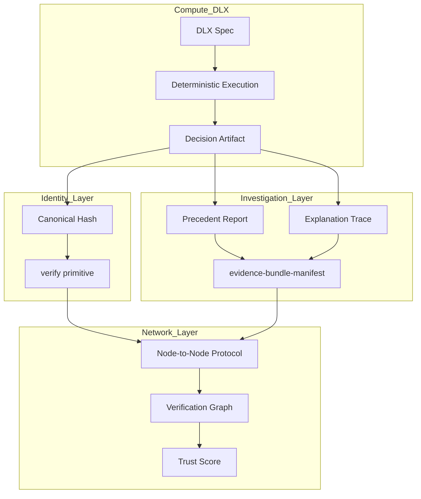

# DeciRepo Network Reference Architecture v0.1

**Status:** Active Reference Architecture  
**Paradigm:** Proof by Recomputation  
**Objective:** Federated Decision Verification Infrastructure

---

## 1. Architectural Layers

The DeciRepo network consists of four functional verticals.

### 1.1 Compute Layer (DLX)
- **Role:** Deterministic decision execution.
- **Primitive:** `result = f(inputs, policy)`.
- **Output:** Decision Artifact with canonical execution trace.

### 1.2 Identity & Verification Layer
- **Role:** Ensuring reproducibility and integrity.
- **Primitives:** `verify(decision_id)`, `rebuild(model, inputs)`.
- **Key Artifacts:** Identity Hashes, Canonical Serializations.

### 1.3 Evidence & Investigation Layer
- **Role:** Contextualizing decisions for audit.
- **Components:** Precedent Retrieval, Decision Explanations, Divergence Detection.
- **Root Identity:** `evidence-bundle-manifest`.

### 1.4 Network & Trust Layer (DeciRepo Federation)
- **Role:** Distributing verification capacity.
- **Components:** Node Manifests, Verification Graph, Node-to-Node Protocol.
- **Metric:** Trust Score derived from independent verification density.

---

## 2. The Verification Flow

DeciRepo replaces global consensus with **independent deterministic recomputation**:
1. **Publish:** Origin Node registers a Decision Artifact.
2. **Discover:** Network participants resolve the Node Manifest.
3. **Verify:** Independent Verifiers execute `verify(decision_id)` via local rebuild.
4. **Record:** Verification results are added to the Verification Graph.
5. **Emergent Trust:** A decision gains legitimacy as the count of independent "MATCH" rebuilds increases.

**Core Formula:**  
`Trust(decision) ∝ independent_rebuild_matches`

---

## 3. Scaling Model

DeciRepo scales linearly:
- **Horizontal:** Each new node adds its local verification throughput to the network.
- **Asynchronous:** Verification does not block publication or other verifications.
- **Stateless:** The `verify` primitive does not depend on a shared mutable global state.

---

## 4. System Map (Mermaid)

---

## 5. Security Principles
- **Immutability:** Once an artifact is hashed, any change breaks the rebuild match.
- **Transparency:** All match dimensions and divergence signals are explicit.
- **Independence:** Trust is a derivation of multiple independent rebuilds, not a centralized claim.

---

## 6. Summary
DeciRepo is a **running verification network**. It transforms decisions from subjective records into verifiable digital artifacts through the discipline of deterministic recomputation.
